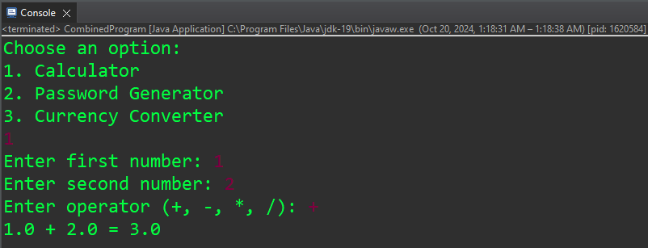
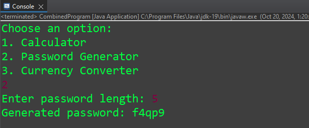
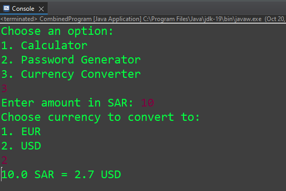

# Combined Program

## Project Overview
This Combined Program is a Java application developed for the third semester at Imam Mohammed University. It incorporates three functionalities: a simple calculator, a password generator, and a currency converter.

## Features
1. **Calculator**: Perform basic arithmetic operations (+, -, *, /) on two numbers.
2. **Password Generator**: Generate a secure password of specified length using a mix of characters.
3. **Currency Converter**: Convert Saudi Riyals (SAR) to Euros (EUR) and US Dollars (USD).

## Screenshots




## Usage
1. Clone the repository:
2. Compile the program:
   ```bash
    javac CombinedProgram.java
    ```
3. Run the program:
   ```bash
    java CombinedProgram
    ```
4. Follow the on-screen instructions to choose the desired functionality.

## Presentation
A PDF presentation summarizing the project is available for download:
[Project Presentation](presentation.pdf)

## Author
[Mohammed Aleshawi]  
Imam Mohammed University  
Third Semester

## Acknowledgements
- Thanks to my professors and peers for their guidance and support during this project.